# Architecture

## System Overview

Compliance Academy is a multi-agent role-play game built on Microsoft Foundry Agent Service, using the Connected Agents pattern with Model Router for cost-aware routing across multiple model families. The system models a corporate compliance investigation as the playable surface. Reasoning agents handle orchestration, evidence analysis, and scenario generation. Persona agents handle in-character dialogue.

## Topology

```mermaid
flowchart TD
    Player[Human Player<br/>Lead Investigator] --> GM[Game Master Agent<br/>Orchestrator + Narrator + World Builder]

    GM <--> FA[Forensic Analyst<br/>Digital forensics, anomaly detection]
    GM <--> IT[IT Specialist<br/>Network and access control]
    GM <--> HR[HR Liaison<br/>Rapport, ethics]
    GM <--> CA[Compliance Auditor<br/>Frameworks, control mapping]
    GM <--> WC[Whistleblower Contact<br/>Rival archetype]

    GM <--> Suspects[Suspect Pool<br/>Alex, Morgan, Riley, Casey, Jordan]
    GM <--> SG[Scenario Generator<br/>Live-twist case builder]
    GM --> CO[Compliance Officer<br/>Post-scene educator]

    Host[Host / Audience<br/>Surprise breach prompt] --> SG

    GM --> Tools[Code interpreter<br/>State mutator<br/>Web search]

    FA -. queries .-> FIQ[(Foundry IQ<br/>Compliance frameworks<br/>Synthetic policies)]
    CA -. queries .-> FIQ
    CO -. queries .-> FIQ
    IT -. queries .-> WIQ[(Work IQ signals<br/>Synthetic employee profiles)]
    HR -. queries .-> WIQ
    FA -. walks .-> FabIQ[(Fabric IQ<br/>Investigation ontology)]

    GM --> Router{{Model Router<br/>Quality / Balanced / Cost}}
    Router --> Models[gpt-5, gpt-5-mini, o4-mini,<br/>claude-sonnet-4-5, claude-haiku-4-5]

    GM --> Response[Scene narration, rolls,<br/>evidence updates, state transitions]
    Response --> Player

    classDef human fill:#9ca3af,stroke:#4b5563,color:#fff
    classDef orchestrator fill:#7c3aed,stroke:#5b21b6,color:#fff
    classDef party fill:#2563eb,stroke:#1d4ed8,color:#fff
    classDef suspects fill:#dc2626,stroke:#991b1b,color:#fff
    classDef specialty fill:#d97706,stroke:#92400e,color:#fff
    classDef knowledge fill:#16a34a,stroke:#15803d,color:#fff
    classDef infrastructure fill:#0d9488,stroke:#115e59,color:#fff

    class Player,Host,Response human
    class GM orchestrator
    class FA,IT,HR,CA,WC party
    class Suspects suspects
    class SG,CO specialty
    class FIQ,WIQ,FabIQ knowledge
    class Tools,Router,Models infrastructure
```



**Legend:** gray = human inputs and outputs; purple = orchestrator; blue = investigator party (player's allies); red = suspects (under interrogation); amber = specialty agents (live-wildcard generator and post-scene educator); green = Microsoft IQ knowledge sources; teal = model infrastructure.

## Agent Specifications

| Agent | Layer | Reasoning model? | Routing mode | Primary tools |
|---|---|---|---|---|
| Game Master | Orchestrator | Yes | Quality | Code interpreter (dice), state mutator, Foundry IQ |
| Forensic Analyst | Party | Yes | Quality | Foundry IQ, Fabric IQ semantic queries |
| IT Specialist | Party | Partial | Balanced | Work IQ queries, code interpreter |
| HR Liaison | Party | Partial | Balanced | Work IQ queries |
| Compliance Auditor | Party | Yes | Quality | Foundry IQ (frameworks), Fabric IQ (control mapping) |
| Whistleblower Contact | Party (rival) | No | Cost | Limited (intentionally opaque) |
| Suspect (x5 per scenario) | NPC | No | Cost | None (pure persona) |
| Scenario Generator | Live wildcard | Yes | Quality | Web search (for breach references), state initializer |
| Compliance Officer | Post-scene | No | Balanced | Foundry IQ |

Reasoning-heavy agents (Game Master, Forensic Analyst, Compliance Auditor, Scenario Generator) are configured with Quality routing mode so Model Router prefers reasoning-capable models. Persona-heavy agents (Suspects, Whistleblower Contact) use Cost mode for speed and budget. Supporting agents use Balanced.

## Foundry Connected Agents Pattern

The Game Master is configured as a primary Foundry agent with the other agents declared as connected agents. The Foundry runtime handles the orchestration plumbing. The Game Master's tool list includes references to each connected agent, plus shared tools (code interpreter, Foundry IQ retrieval, state mutation).

Decision logic in the Game Master's system prompt determines which connected agent to invoke at each turn:

- Party-side queries (the player asking for an opinion, requesting a skill check) route to the relevant party member by specialty
- Interrogation turns route to the active suspect
- Scene transitions (end of an act) trigger the Compliance Officer for debrief
- Live-twist invocations (host throws a new breach) route the input to the Scenario Generator

State mutations always pass back through the Game Master so there is one source of truth for the world.

## Model Router Configuration

Model Router deployed in your Foundry resource (`<your-unique-foundry-name>`) in East US 2 or Sweden Central, the two Model Router-supported regions.

Selected model subset:

- `gpt-5` and `gpt-5-mini` (OpenAI reasoning and general)
- `o4-mini` (OpenAI reasoning, smaller and faster)
- `claude-sonnet-4-5` (Anthropic, persona-strong, reasoning-capable)
- `claude-haiku-4-5` (Anthropic, fast persona work for suspects)

Claude models require separate deployment from the model catalog before Model Router can route to them. Both Sonnet and Haiku need to be deployed in the same resource group as the Router.

Automatic failover is enabled by default. If a model has a transient issue mid-stream, Model Router redirects to the next-best fit silently, with the configured routing mode applied to the failover decision.

### Caveat: Agent Service Tools Force OpenAI Routing

Per the Model Router documentation, when an agent makes a call that uses Agent Service tools (code interpreter, Foundry IQ retrieval, connected agent invocation, state mutation), Model Router will only consider OpenAI models for that turn, even if Claude models are in the subset. Practical effect for Compliance Academy:

- The Game Master, Forensic Analyst, Compliance Auditor, IT Specialist, HR Liaison, and Compliance Officer all use tools during normal play. Their turns route to OpenAI models regardless of subset configuration.
- The Suspect agents and the Whistleblower Contact run pure persona turns with no tools. Their turns can route to Claude models (Haiku for speed, Sonnet for richer rivals).

Claude deployment is therefore valuable for suspect dialogue quality, but the system is fully functional with an OpenAI-only subset. Treat Claude as a stretch goal.

## Microsoft IQ Integrations

### Foundry IQ (case file knowledge base)

Foundry IQ in this project is implemented via Azure AI Search's agentic retrieval feature. The knowledge base abstraction (Knowledge sources, Knowledge bases, Indexes, Indexers, Skillsets) lives natively in the search service and is fully manageable from either the Azure AI Search portal or the Foundry portal. Agents query it through the Azure AI Search SDK at runtime. See `docs/foundry_setup.md` Section 6 for the build path.

Knowledge base populated with synthetic content:

- Helix Dynamics internal security policies (fabricated)
- SOC2 Trust Service Criteria reference (synthetic excerpts)
- NIST 800-53 control catalog (synthetic excerpts)
- ISO 27001 Annex A (synthetic excerpts)
- HIPAA Security Rule (synthetic excerpts, relevant to biotech context)
- Synthetic incident response playbooks
- Synthetic vendor risk procedures

The Forensic Analyst, Compliance Auditor, and Compliance Officer query Foundry IQ during interrogations and debrief. Citations are surfaced in the UI so the audience sees grounded answers tied to specific control references.

### Work IQ (synthetic employee work signals)

Each Helix Dynamics employee in a scenario has a Work IQ-style profile:

- Meeting hours per week
- Focus hours per week
- Typical collaboration partners
- After-hours activity patterns
- Recent access to sensitive systems

These signals become investigative evidence. Anomalies (a suspect logged in at 3 AM when their typical activity ends at 6 PM) become clues the IT Specialist or HR Liaison can surface during interrogations. Synthetic only, no real Microsoft 365 data is used.

### Fabric IQ (semantic investigation model)

A synthetic ontology connecting:

- **Employees** (entity)
- **Roles** (entity, with required clearances)
- **Systems** (entity, with access requirements)
- **Policies** (entity, with controlled scope)
- **Breach vectors** (entity, with mapped indicators)

Relationships: employee-has-role, role-grants-access-to-system, system-is-scoped-by-policy, breach-vector-violates-policy, indicator-evidences-breach-vector.

The Forensic Analyst uses this ontology to walk a knowledge graph during reasoning. The post-scene readiness view renders semantic statements ("EMP-001 demonstrates a gap on vendor risk under SOC2 CC9.2") that come directly from the ontology.

## Game Mechanics

### Shared State

Persisted in JSON, mutated by the Game Master through a typed tool interface. The audience sees discrete state changes rather than free-text drift.

```json
{
  "scenario_id": "SCN-001",
  "scenario_name": "Breach at Helix Dynamics",
  "current_act": 2,
  "active_suspect": "alex_chen",
  "evidence_inventory": [
    {"id": "EV-001", "source": "IT logs", "content": "MFA bypass at 02:47 AM", "value": 8}
  ],
  "suspect_trust": {
    "alex_chen": 0.4,
    "morgan_webb": 0.6,
    "riley_park": 0.2,
    "casey_doyle": 0.7,
    "jordan_smith": 0.9
  },
  "party_morale": 7,
  "active_quest": "Identify the exfiltration vector",
  "world_flags": {
    "vendor_mfa_disabled_discovered": true,
    "intern_phished": false
  }
}
```

### Dice Mechanics

Lightweight d20-based system. The Game Master prompts the code interpreter to roll when:

- Player attempts something risky (intimidation, demanding privileged records)
- Party member proposes a skill check (forensic analysis, policy lookup, persuasion)
- Suspect's resolve is being tested

Roll structure:

```json
{
  "actor": "Forensic Analyst",
  "check": "log analysis",
  "roll": 17,
  "modifier": 4,
  "difficulty": 18,
  "result": "partial_success",
  "consequence": "Identifies that the MFA bypass log was tampered with, but cannot recover the original entry"
}
```

### Evidence Inventory

Player and party accumulate evidence across acts. Each evidence item has a source, content, and value (0 to 10). Evidence with combined value above a threshold unlocks the accusation option in Act 3.

### Act Progression

Acts advance based on state. The Game Master decides when enough has happened to move to the next act, with thresholds defined by total evidence value, number of suspect interactions completed, and explicit player intent.

## Tool Integrations

- **Code interpreter** (Foundry built-in): dice rolls, modifier math, time and date calculations on Work IQ signals
- **Foundry IQ retrieval**: cited compliance content surfaced inline
- **Web search** (Foundry built-in): the Scenario Generator uses this to ground new cases in real-world breach references, with the explicit disclaimer that all generated content is synthetic
- **State mutation** (custom tool): the Game Master mutates shared state through a typed interface
- **MCP dice roller** (optional polish): exposes dice mechanics as a standalone MCP tool the GM can call; useful demo material if time permits

## Synthetic Data Sources

All data is generated for this project. No real customer information, no PII, no copyrighted material.

Actual files under `data/synthetic/`:

- `foundry_iq/frameworks/*.md`: synthetic excerpts of SOC 2, HIPAA, ISO 27001, NIST 800-53
- `foundry_iq/helix_policies/*.md`: 4 synthetic Helix Dynamics internal policies (access control, data classification, incident response, vendor management)
- `foundry_iq/playbooks/*.md`: 3 synthetic incident-response playbooks (credential compromise, insider threat, vendor breach)
- `foundry_iq/helix_dynamics_overview.md`: company background
- `scenarios/_shared/scenario_commons.json`: canonical suspect base personas, company profile, system list
- `scenarios/helix_dynamics_default.json`: SCN-001, the default playable scenario
- `scenarios/helix_dynamics_supplychain.json`: SCN-002, pre-built backup scenario
- `scenarios/helix_dynamics_vishing.json`: SCN-003, pre-built backup scenario

The ~52 chunks in the Azure AI Search index `compliance-content-index` are produced by the indexer running over the markdown content above.

Work IQ employee signals and Fabric IQ semantic model files were scoped out of the live-battle build to keep the surface tight. Both could be added without changing the agent topology.

## UI Layer

Chainlit handles the player-facing UI. Selected for three reasons:

1. Native rendering of streaming reasoning chains (the central showcase)
2. Distinct avatars and colors per agent (turns the interrogation into a visible cast)
3. Eliminates the build-a-chat-UI tangent that would eat days from a 16-day window

The Chainlit configuration assigns each agent its own avatar, color, and visible role label. The audience sees who is speaking and why.

## Deployment

Local development happens in VS Code with Python 3.10+. Connected Agents are deployed to the Foundry project. The Chainlit UI runs locally for the demo; a hosted version is a stretch goal not required for the live battle.

Environment variables (in `.env`, not committed):

```
AZURE_AI_PROJECT_ENDPOINT=<from Foundry portal>
AZURE_AI_MODEL_ROUTER_DEPLOYMENT=<router deployment name>
AZURE_AI_EMBEDDING_DEPLOYMENT=text-embedding-3-large
AZURE_AI_CHAT_DEPLOYMENT=gpt-4.1-mini
AZURE_SEARCH_ENDPOINT=https://<your-search-service>.search.windows.net
AZURE_SEARCH_INDEX_NAME=compliance-content-index
AZURE_SEARCH_API_VERSION=2024-07-01
```

## Reliability Considerations

- Default Helix Dynamics scenario is fully hand-crafted as the fallback if the Scenario Generator misbehaves under live conditions
- Two pre-built backup scenarios (`helix_dynamics_supplychain.json`, `helix_dynamics_vishing.json`) are checked into the repo for live-demo recovery
- Model Router automatic failover handles transient model issues without stopping the demo
- Suspect dialogue passes through a content filter to prevent the role-play from generating anything inappropriate for the YouTube audience
- A "panic button" in the Chainlit UI reloads the scenario from a known-good state if anything looks off mid-stream

## Out of Scope (Explicitly)

To keep the 16-day window achievable, the following are deferred:

- A hosted Manager Insights dashboard (the data is modeled, the visualization is not built)
- Multi-session player progression and persistent character sheets
- Voice or speech input
- Image generation for suspect portraits (text-based personas only)
- A standalone player-onboarding tutorial
- Mobile-responsive UI
- Authentication and multi-user support (single-player demo only)
